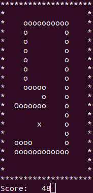

# Snake for x86 64-bit Linux.

Implemented in assembly and tested on Ubuntu 18.04.4 LTS.



## Requirements

ld (sudo apt-get install build-essential)  
yasm (sudo apt-get install yasm)

## Build
```bash
	./complie.sh
```

## Run
```bash
	./build/Snake
```
